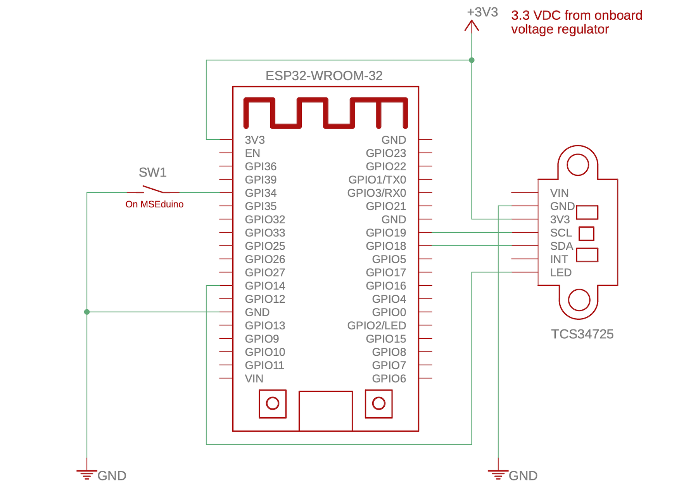

# TCS34725 Demo

This demo connects to a TCS34725 colour sensor over the I2C bus and allows the measured colour components to be observed using the Serial Monitor. If working properly, the RBGC values will vary when objects of different colours are placed in close proximity to the sensor. SW1 (S1-2) may be used to turn the illumination LEDs on the TCS34725 on and off.

## Hardware Required

For this demo, you will require the following components:

* MSEduino ESP32-based development board
* TCS34725 colour sensor
* Jumper or Dupont wires (–F) to connect components

### Library Installation

In order to compile properly, the code in this repository requires the following libraries to be installed:

#### Adafruit NeoPixel

The [Adafruit NeoPixel Library](https://github.com/adafruit/Adafruit_NeoPixel) is a third-party library that can be installed directly from the Arduino IDE Library Manager. Go to **Tools→Manage Libraries...**. Use the search box to find and install the AdaFruit NeoPixel library.

#### Adafruit TCS34725

The [Adafruit TCS34725 Library](https://www.arduino.cc/reference/en/libraries/adafruit-tcs34725/) is another third-party library that can be installed from the Ardinio IDE Library Manager. Go to **Tools→Manage Libraries**. Enter "tcs34725" in the filter textbox. Scroll to find the "**Adafruit TCS34725** by Adafruit" library. Ensure that the latest version (≥ 1.4.4) is selected and press the **INSTALL** button. You will be asked whether you also want to install the dependency **Adafruit BusIO**. Select **INSTALL ALL**. 

## Resources

* [Arduino Language Reference](https://www.arduino.cc/reference/en/)
* [TCS34725 Colour Sensor Datasheet](https://cdn-shop.adafruit.com/datasheets/TCS34725.pdf)
* [Adafruit TCS34735 Arduino Library](https://www.arduino.cc/reference/en/libraries/adafruit-tcs34725)
* [Adafruit TCS34725 GitHub](https://github.com/adafruit/Adafruit_TCS34725)
